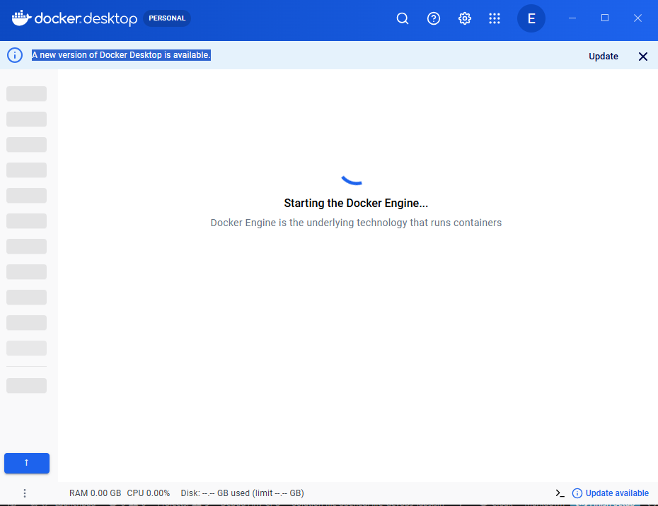

# Lab 08 — Full-Stack Docker Compose: Status Notes

## Status: Incomplete — Docker could not start

All files are written and committed (see commit `43fb2e8`), but `docker compose up --build`
could not be executed due to a Docker Desktop issue on the local machine.

## What was completed

- `docker-compose.yml` — all 10 services wired up (nginx, frontend, backend, postgres, redis,
  rabbitmq, kafka, keycloak, loki, grafana) with healthchecks, volumes, env vars, depends_on
- `loki/loki-config.yml` — single-node Loki observability config
- `nginx/nginx.conf` — reverse proxy routing `/api` to backend, `/` to frontend
- `grafana/provisioning/datasources/loki.yml` — auto-provisioned Loki datasource
- `../07-debugging/backend/.dockerignore` — excludes bin/ and obj/
- `../07-debugging/frontend/.dockerignore` — excludes node_modules/ and .next/

## What went wrong

Docker Desktop failed to start cleanly after a forced kill during a previous session.

**Root cause:** The containerd storage hit an I/O error during image pulls (disk was nearly
full at 8.1 GB free). After freeing ~3 GB and restarting Docker Desktop, the WSL2 backend
entered an unrecoverable state and `wsl --shutdown` did not resolve it.

I will try to complete this task later

[def]: image.png